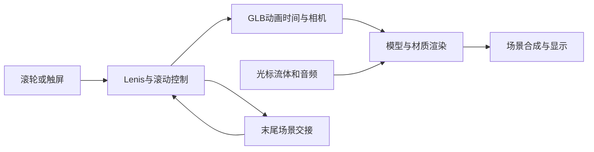
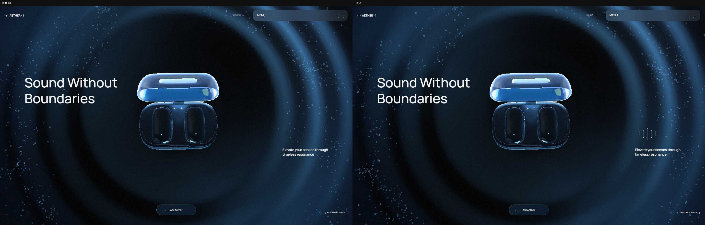
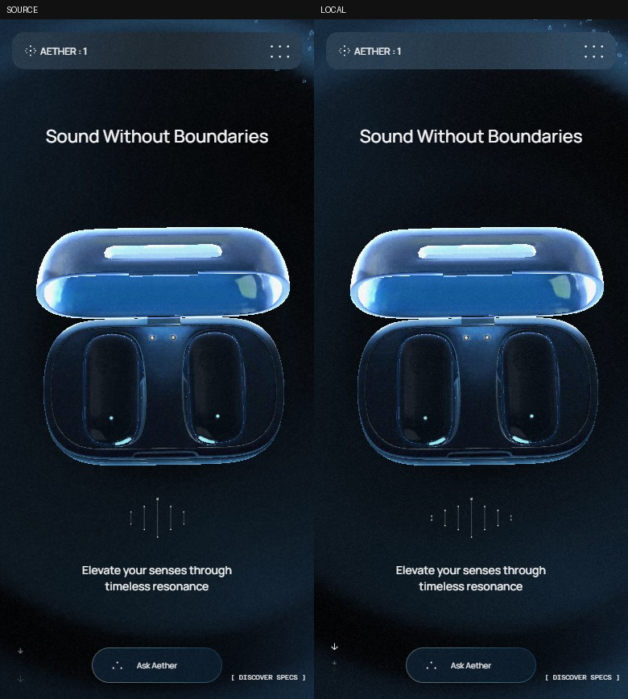

# SANGRE 替换实现汇报

更新日期：2026-10-07。预览：[SANGRE 展示主页](http://localhost:4190/)。

本次将独立 Aether 原型的主页耳机替换为 SANGRE，完成五章叙事：机身、屏幕展开、材料细节、插条、内部结构。Discover Space 与独立 Specs／Preorder 页面保留原内容和模型。个人网页其他部分没有变更。

## 实时屏幕与特写（本次更新）

Display 章节现在先靠近折叠屏幕，再随上半屏展开延伸界面，最后停留在可操作的长屏特写。可从菜单 **Display** 直接进入。界面参照用户的 `09毕设/1-1.png` 和 `3-2.jpg`，保留白色指标卡片、珊瑚色导航与四色图表。

屏幕正常显示使用实时 React／DOM，而非预先生成的界面截图。根据真实前屏网格的四角计算透视映射，将上下两半内容投影到相应面板；上半屏转向正面后，内容沿铰链逐步延伸，追加下一次检测与血脂项目。完整展开的特写提供一个可访问、可点击的界面，两个展示镜像均设置为 inert，避免重复键盘控件。逐帧位置、高度和展开程度直接更新 DOM 样式，不触发每帧 React 重绘；场景转场时保留原屏幕纹理作备用。复用已有渲染器及 React，没有增加依赖或修改原 GLB。

可以切换 Today／Week／Month／3 Months，并看到数值和 SVG 图表动画更新；点击卡片查看对应指标详情；调整长短名称；运行、取消演示检测；在完成后查看新增历史记录，并打开该条记录的数值与时间。Reset demo 恢复初始状态。演示记录仅存在当前页面内存，刷新后恢复；没有连接真实设备、账户或临床检测服务。

按 Design Taste Frontend 对实际截图迭代，修复了 GLB 的 UV 上下方向、展开拼接处重复内容、方屏特写在手机上的裁切、说明文字落在浅色外壳上的低对比，以及 320 px 窄屏的触控区域。增加单位字号，说明移到模型之外，短视口标题为屏幕让出空间。检测卡片整块可点击，返回、取消与设置控件扩大；最终手机仪表盘、详情、检测、设置中的按钮及选择控件均至少 44×44 CSS px。特写有意允许周边机身局部出画，屏幕保持完整；其余章节仍展示设备与爆炸组件。

## 正反面更正

用户指出上一版把 UI 放到了背面。重新对照 `09毕设/final.png` 中明确标注的 Front view／Back view、`3-2.jpg` 的渲染和原 GLB 面片后，确认原因：误把 `90光泽` 的 `.012` 后面板作为显示面。仅旋转镜头无法修复这个错误。

当前改用 `.016` 的前面板，屏幕宽度由错误的 88.5 mm 改为源模型的 77.5 mm，折叠高度由 44.6 mm 改为 63.2 mm。背板及其原边框保留，UI 只生成在前斜面。同步修正主镜头和光照朝向，调整屏幕、电池的爆炸分离位置及手机构图，并消除展开 UI 中缝的黑色横带。原始 GLB、渲染图和工图均未修改。

上一轮检查覆盖了交互、加载和排版，却漏掉模型正背面的语义核对，其“通过”结论不能证明设备方向正确。本轮增加导出前的源表面法线断言、屏幕尺寸／位置检查，以及浏览器中对实际 GLB 面法线和相机方向的检查，再人工对照参考图。下面的验证和截图路径已更新为本次修正版。

## 爆炸间距优化

针对用户指出的零件重叠，将透明罩、上壳、光度计组件、底壳与脚垫分成更清楚的纵向层级；屏幕、电池及开关向侧边分离。手机采用较紧凑的屏幕侧移，镜头距离随爆炸程度连续变化，收拢时仍为尚未归位的组件保留取景空间。说明文字移至模型之外。只调整展示位移及镜头，原 CAD 几何和装配端点不变。

按 Design Taste Frontend 复查实际画面，经历层间距扩大、内部与底壳分离、手机裁切修正、收拢阶段取景修正。三种视口各采集五个展开／收拢阶段，检查所有部件边界及完全展开时四组主要层的可见间隙。早期截图曾捕获原文字转场的交叉淡入，等待转场结束后重新采集，确认没有持续文字重叠。

## 资产与实现

从用户提供的 `E:/Codex File/三视图+特写.glb` 提取设备和试纸条，排除摄影棚、房间、灯光及重复展示。网页 GLB 包含 39 个网格、283,727 个三角形，为约 9.5 MB，原场景约 70.6 MB，减少约 87%。内部组件复用此前提供的爆炸 CAD，包括外壳、18650 电池、光度计、固定件与垫板。已有屏幕图保留为场景切换备用，正常屏幕内容使用实时界面。

只扩展原渲染器：背景仍使用作者相机，产品使用独立相机绘制到同一画布。这样保持原背景空间关系，也避免粒子覆盖设备和屏幕。两套首页场景均装入 SANGRE，确保循环交接时外观一致；Specs、声明页与备用场景不替换。

屏幕包含两块面板，随滚动展开并切换完整 UI。修正了 Blender 与 GLB 的局部坐标转换、折叠面板遮挡和 UI 上下半图顺序。插条按录屏表现沿长轴平移，样本面向上，调整导槽终点与灰色主体／红色样本标记。导出液面低于槽口，为可见性作了 2.1 mm 的展示适配；不作为真实液量定义。插条章节暂时隐藏透明罩并在说明中标明剖视，没有制作未经证实的罩盖机构。

## Design Taste Frontend 评判与迭代

采用 `C:/Users/严/.codex/skills/taste-skill/SKILL.md`，按现有网页的视觉语言评估实际截图。保留原字体、深蓝色背景和滚动节奏，避免加入不相干的卡片、徽标及装饰。

首轮发现屏幕被背板遮挡、产品相机改变背景层次、手机标注与模型重叠。随后分别修正坐标与遮挡、将背景和产品分两次绘制、收紧手机标注。后续继续调整展开端点、模型比例、结构镜头、说明位置、窄屏标题间距，以及试纸条的可见路径和配色。动画端点检查还修复了循环末尾缩放不一致。

正反面修正版再次检查桌面 1440×900、手机 390×844 与窄屏 320×740，以工图的 Front view 和用户渲染为设备方向依据。折叠屏幕位于正确一侧，展开 UI 连续，分离的屏幕与电池完整入镜；结构说明位于组件外围，手机保留单个重点说明，插条动作播放时隐去标注，完成后显示。本轮达到可交付的展示质量，没有把“最佳”表述为客观的绝对完美或逐像素等同原站。

## 验证

- 扩展后的桌面／手机交互检查：55 个状态、58 项断言通过，覆盖时间范围、指标详情、键盘操作、名称设置、检测取消、完成与保存、记录详情、重置、页面滚动，以及真实前屏朝向、爆炸间距、导航、声音、Discover、返回与循环。
- 最终生产版 1440×900、390×844、320×740：各 10 个章节／展开阶段，共 30 个状态。检查屏幕投影边界、可交互阶段、触控尺寸、手机真实 tap、指标详情、演示检测、历史与退出滚动；无异常浏览器日志、资源失败、错误遮罩或页面横向溢出。
- 最终生产版减少动态效果模式：图表／扫描 CSS 动画关闭，时间范围按钮仍可使用。此前爆炸间距修正还采集了三种视口共 15 个爆炸／收拢状态；本次未更改其几何或位移。
- 前次正反面修正还检查了三种视口共 15 个完整章节状态的实际 UI 法线及相机方向；模型资产本次未修改。
- 减少动态效果：新产品动画采用固定章节姿态，关闭指针漂移与插条自动播放。
- 模型失败：明确显示重试按钮；恢复资源后点击重试能重新加载。
- 保留页生产路径直达成功；原 HTML 与模型资产不修改。
- `tests/sangre-pose.mjs`：检查源前屏法线、位置、77.5 mm 宽度、前向相机、特写端点、展开、插条、爆炸、边界与循环；另检查仿射及透视映射的四角精度，通过。
- 生产构建与 4 项现有 Sites／静态路径检查通过。

浏览器工具未提供可调用的 Browser 技能接口，因此沿用项目已有的 Playwright 和本机 Chrome 进行实测。当前截图与 JSON 保存在：

`C:/Users/严/.codex/visualizations/2026/10/06/01a11086-2db3-7203-8735-754fb721f06b/sangre-qa/live-screen/`

`final/` 保存最终生产屏幕与各章节截图、详情／扫描／历史状态、减少动态效果截图，以及 `review.json` 的屏幕投影和触控尺寸记录。`results.json` 与 `implementation/` 保存 55 个状态的功能及原页面回归检查；该轮检查后又做了字体、说明位置和窄屏取景修正，因此最终视觉应以 `final/` 为准。相邻的 `explosion-spacing/`、`front-correction/` 保留此前间距与方向证据。

复查命令：`node tests/sangre-pose.mjs`；`npm run build`；`npm run test:sites`；设置 `LOCAL_URL`、`QA_DIR` 后运行 `node scripts/verify-browser.mjs`。当前环境通过 bundled Node 直接调用 Vite 与打包脚本执行等价构建。

## 展示边界

屏幕展开依据两个尺寸不同的源端点作展示插值，尚不是精确的制造铰链仿真。KeyShot 的材质以网页 PBR 近似，未声称与原离线渲染完全一致。界面交互真实执行，但读数、趋势与检测均为设计演示，记录不跨刷新保存。验证使用本机 Chrome／Playwright 的桌面与移动视口，尚未实测手机硬件帧率及 Safari。

---

以下是 2026-10-06 的原站复刻历史记录；其中的原站保真与资产统计描述的是替换之前的版本。

# Aether 1 高保真复刻实现汇报

完成日期：2026-10-06。独立项目：`E:\Codex File\OWN WEB\standalone\aether-replica`。本地预览：[打开 Aether 复刻](http://localhost:4190/)。

本次交付保存了原站的三个公开导航页面：主页、Specs 和 Preorder，包括模型、材质、字体、声音、滚动驱动动画和页面转场。最终完成 45 组原站／本地状态对照，共 90 张浏览器截图，并通过生产页面直接访问与触屏滑动检查。当前捕获范围内没有发现需要修正的前端布局或资产差异。私有 AI 后端没有包含，实时动画截图也不代表逐帧像素完全相同；这两个边界在下面说明。

**先确认网页实际如何工作。**

Aether 1 是 OFF+BRAND 的虚构耳机展示项目。作者将它作为品牌、3D 与交互技术的内部实验，Preorder 最终通向工作室介绍，页面并没有实际付款流程。[作者项目介绍](https://www.itsoffbrand.com/our-work/aether1)。

页面使用 Webflow 标记与样式，加上自定义前端运行时。作者的技术文章说明了 GLB 烘焙动画、相机轨迹、滚动控制、GPU 粒子、流体光标和声音响应的组合方式。[作者技术文章](https://tympanus.net/codrops/2025/08/06/building-aether-1-sound-without-boundaries/)。这决定了复刻需要保留模型和运行时之间的对应关系，而非只制作几个视觉相近的静态镜头。

我还检查了浏览器实际加载的打包文件。文件携带的源码映射可读出 69 个作者 JavaScript／TypeScript 模块，包括 `SceneMain`、`SceneSpecs`、`ScrollController`、`Assets`、`Materials`、`FluidCursor` 和 `Aether`。本次使用这些模块了解运行机制，并保留原运行时实现。没有发现能够确认完整上游工程及开源许可的官方公开仓库；公开可访问的文件不构成开源许可。

资产保存的依据是你在本次会话中确认已获得作者授权。首次直接请求模型等资源时返回 403，保存浏览器资源也曾被自动审批拒绝；在你确认授权后，重新审批通过，正常浏览页面取得了所需资源。最终没有需要使用自制模型或贴图替代的可见资产。

**采集和实现的步骤。**

1. 在 1440 × 900 桌面视口和 390 × 844 手机视口采集首页、菜单、各个动画章节、输入框以及辅助页面。规格页按小段滚动，覆盖从标题、响应范围、耳机／盒体尺寸，到连接性、材质、电池与声音质量的全部可见内容。
2. 等待原站 `html.is-ready` 后再截图。早期辅助页面仍停留在载入画面，因此补拍了真实载入完成后的证据。保存 DOM、正文、链接、字体和布局数据，确定实际交互结果。
3. 将页面需要的资源保存到本地。保留图标、标记与说明线的原始 SVG，以及原字体文件和材质贴图，不重新画近似图形。
4. 用原生 Product Design 网页模板创建独立 Vite／React 项目。三个 HTML 文件保留原页面标记，React 完成一次挂载后启动作者运行时；后续动画和页面转场由原运行时管理。
5. 将 CSS、字体、模型、贴图、Draco 和音频地址改为同源本地路径。移除分析统计请求、外部资源提示和重复样式链接。保留原有动画参数、文案、配色、材质与镜头。
6. 启动本地预览后进行逐项交互、并排截图和 DOM 测量。最后构建生产文件，并直接打开三个生产路径检查真实渲染。

**资产和动画保留情况。**

| 类型 | 本地文件数 | 具体内容 |
| --- | ---: | --- |
| 模型 | 1 | `scene-258.glb`，585,984 字节 |
| 材质贴图 | 14 | AO、透明度、发光、法线、硅胶、玻璃 matcap、噪声与光晕 |
| 音频 | 7 | 两段循环音与问答／菜单提示音 |
| Draco | 2 | WASM 解码器与 JavaScript 包装器 |
| 其余资源 | 18 | 7 个字体、2 个 CSS、4 个前端脚本、5 个图像／SVG 资源 |
| 合计 | 42 | `public` 中资源共 5,564,439 字节 |

GLB 实际包含 21 个网格、48 个节点和 15 条动画。动画涉及盒盖、耳机、硅胶、核心、扬声部件、相机、相机目标、视场角以及交互驱动节点。相关清单可在 [资产清单](asset-manifest.json) 中查看。

原站的备用纯 JavaScript Draco 解码器未在本次浏览器运行路径中加载，未复制该文件；实际加载的 WASM 解码路径已经完整本地化。浏览器检查没有发现缺失的本地模型、贴图、字体、声音或解码器请求。

滚动进度驱动 GLB 的动画时间及相机位置，GSAP 时间线补充视场角、显隐和转场；粒子与光标流体效果持续在 GPU 上更新。主页末尾通过两套主场景交接返回开头。原站的这套行为在本地保留，因此鼠标与声音也仍能影响画面。

为了减少加载体积，我移除了运行时中的内联源码映射：运行时文件从约 7.64 MB 降至 1.22 MB，执行代码保持原样，仅做本地路径适配。同时去除了入口对三个页面字符串的重复打包，React 入口由约 909 KB 降至 195 KB，gzip 约 61 KB。69 个作者模块另存为 [可读源码参考](references/runtime-sources.json)，没有放进浏览器必需资源；它们用于阅读，不代表拿到了完整上游构建工程。

**对照、检查和结果。**

[浏览器检查结果](qa/results.json) 包含原站桌面 24 个、原站手机 21 个、本地桌面 24 个、本地手机 21 个状态。所有截图均使用相同 CSS 视口和 `deviceScaleFactor: 1`；每对截图均保留相同像素尺寸，桌面为 1440 × 900，手机为 390 × 844。

检查覆盖主页各章节、菜单展开、核心拆解、声音开启／静音、Ask Aether 展开、空问题拦截、提交失败、重试、Specs 完整滚动、Preorder 与页脚、返回首页、末尾循环。原站与本地采用相同操作顺序与等待条件。

本地通过 28 项交互断言。采样标题、菜单、按钮等 DOM 元素的文字、字体族、字号、字重、行高与颜色全部相同；采样矩形的宽、高、左坐标和顶坐标最大差为 **0 px**，对应状态滚动位置差也为 **0 px**。这项结果仅描述 [记录的采样元素](qa/comparison-metrics.json)，不把它扩展成整幅 WebGL 图像的像素相等声明。

我查看了全部并排状态总览，并放大检查标题、菜单、问答框与价格／按钮区域。模型、玻璃边缘、蓝色外壳、发光核心、说明线、页脚模糊玻璃背景和手机构图一致。实时悬浮角度、流体轨迹、粒子和音频波形会因运行时刻、鼠标轨迹与浏览器帧率变化；原站自身不同时间截图也会出现这些变化。

生产构建通过。另在触屏模式下检查原站和生产版本，两者都能通过滑动推进场景，文档宽度为 390 px，没有横向溢出。生产版本 `/`、`/specs`、`/preorder` 的直接访问均达到 `is-ready`，没有页面异常。[生产检查证据](qa/production-results.json)。本次验证使用 Chrome 和触屏模拟，没有声称完成实际手机硬件上的帧率测量。

本地浏览器没有外部运行资源或统计请求，没有异常的页面错误与资源失败。提交问答时产生的 `/api/agent` 503 及原运行时对应错误日志是下面说明的已知边界。最终前端验收见 [design-qa.md](design-qa.md)，结果为 `passed`。

**完整复刻的边界。**

原站私有 AI 服务不包含在公开前端工程中。参考采集时，原站提交材料问题返回 502，界面显示 `Error - Try Again`。本地将该请求改为同源接口，明确返回 503，保留思考、失败和重试的原始界面。没有制作假冒的生成式答案。因此原站 AI 的成功回答、成功回答衍生的详情与历史记录状态无法在本次采集中确认，也没有被宣称已验证。恢复这些功能需要作者后端或另行实现问答服务。

前端的页面、可见资产、动画运行时和本次可观察的交互已尽量保持原站行为；私有后端和不同时刻的逐帧像素一致不属于已实现结果。所有修改保存在独立目录中，个人网页源文件没有被改动，也没有部署此次项目。

项目保持本地运行。运行、构建与复跑检查的方法在 [README.md](README.md)。
