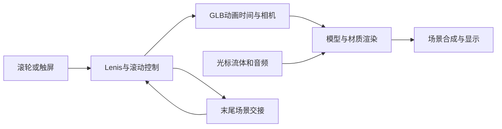

# Aether 1 高保真复刻实现汇报

完成日期：2026-10-06。独立项目：`E:\Codex File\OWN WEB\standalone\aether-replica`。本地预览：[打开 Aether 复刻](http://localhost:4190/)。

本次交付保存了原站的三个公开导航页面：主页、Specs 和 Preorder，包括模型、材质、字体、声音、滚动驱动动画和页面转场。最终完成 45 组原站／本地状态对照，共 90 张浏览器截图，并通过生产页面直接访问与触屏滑动检查。当前捕获范围内没有发现需要修正的前端布局或资产差异。私有 AI 后端没有包含，实时动画截图也不代表逐帧像素完全相同；这两个边界在下面说明。

**先确认网页实际如何工作。**

Aether 1 是 OFF+BRAND 的虚构耳机展示项目。作者将它作为品牌、3D 与交互技术的内部实验，Preorder 最终通向工作室介绍，页面并没有实际付款流程。[作者项目介绍](https://www.itsoffbrand.com/our-work/aether1)。

页面使用 Webflow 标记与样式，加上自定义前端运行时。作者的技术文章说明了 GLB 烘焙动画、相机轨迹、滚动控制、GPU 粒子、流体光标和声音响应的组合方式。[作者技术文章](https://tympanus.net/codrops/2025/08/06/building-aether-1-sound-without-boundaries/)。这决定了复刻需要保留模型和运行时之间的对应关系，而非只制作几个视觉相近的静态镜头。

我还检查了浏览器实际加载的打包文件。文件携带的源码映射可读出 69 个作者 JavaScript／TypeScript 模块，包括 `SceneMain`、`SceneSpecs`、`ScrollController`、`Assets`、`Materials`、`FluidCursor` 和 `Aether`。本次使用这些模块了解运行机制，并保留原运行时实现。没有发现能够确认完整上游工程及开源许可的官方公开仓库；公开可访问的文件不构成开源许可。

资产保存的依据是你在本次会话中确认已获得作者授权。首次直接请求模型等资源时返回 403，保存浏览器资源也曾被自动审批拒绝；在你确认授权后，重新审批通过，正常浏览页面取得了所需资源。最终没有需要使用自制模型或贴图替代的可见资产。

**采集和实现的步骤。**

1. 在 1440 × 900 桌面视口和 390 × 844 手机视口采集首页、菜单、各个动画章节、输入框以及辅助页面。规格页按小段滚动，覆盖从标题、响应范围、耳机／盒体尺寸，到连接性、材质、电池与声音质量的全部可见内容。
2. 等待原站 `html.is-ready` 后再截图。早期辅助页面仍停留在载入画面，因此补拍了真实载入完成后的证据。保存 DOM、正文、链接、字体和布局数据，确定实际交互结果。
3. 将页面需要的资源保存到本地。保留图标、标记与说明线的原始 SVG，以及原字体文件和材质贴图，不重新画近似图形。
4. 用原生 Product Design 网页模板创建独立 Vite／React 项目。三个 HTML 文件保留原页面标记，React 完成一次挂载后启动作者运行时；后续动画和页面转场由原运行时管理。
5. 将 CSS、字体、模型、贴图、Draco 和音频地址改为同源本地路径。移除分析统计请求、外部资源提示和重复样式链接。保留原有动画参数、文案、配色、材质与镜头。
6. 启动本地预览后进行逐项交互、并排截图和 DOM 测量。最后构建生产文件，并直接打开三个生产路径检查真实渲染。

**资产和动画保留情况。**

| 类型 | 本地文件数 | 具体内容 |
| --- | ---: | --- |
| 模型 | 1 | `scene-258.glb`，585,984 字节 |
| 材质贴图 | 14 | AO、透明度、发光、法线、硅胶、玻璃 matcap、噪声与光晕 |
| 音频 | 7 | 两段循环音与问答／菜单提示音 |
| Draco | 2 | WASM 解码器与 JavaScript 包装器 |
| 其余资源 | 18 | 7 个字体、2 个 CSS、4 个前端脚本、5 个图像／SVG 资源 |
| 合计 | 42 | `public` 中资源共 5,564,439 字节 |

GLB 实际包含 21 个网格、48 个节点和 15 条动画。动画涉及盒盖、耳机、硅胶、核心、扬声部件、相机、相机目标、视场角以及交互驱动节点。相关清单可在 [资产清单](asset-manifest.json) 中查看。

原站的备用纯 JavaScript Draco 解码器未在本次浏览器运行路径中加载，未复制该文件；实际加载的 WASM 解码路径已经完整本地化。浏览器检查没有发现缺失的本地模型、贴图、字体、声音或解码器请求。

滚动进度驱动 GLB 的动画时间及相机位置，GSAP 时间线补充视场角、显隐和转场；粒子与光标流体效果持续在 GPU 上更新。主页末尾通过两套主场景交接返回开头。原站的这套行为在本地保留，因此鼠标与声音也仍能影响画面。

为了减少加载体积，我移除了运行时中的内联源码映射：运行时文件从约 7.64 MB 降至 1.22 MB，执行代码保持原样，仅做本地路径适配。同时去除了入口对三个页面字符串的重复打包，React 入口由约 909 KB 降至 195 KB，gzip 约 61 KB。69 个作者模块另存为 [可读源码参考](references/runtime-sources.json)，没有放进浏览器必需资源；它们用于阅读，不代表拿到了完整上游构建工程。

**对照、检查和结果。**

[浏览器检查结果](qa/results.json) 包含原站桌面 24 个、原站手机 21 个、本地桌面 24 个、本地手机 21 个状态。所有截图均使用相同 CSS 视口和 `deviceScaleFactor: 1`；每对截图均保留相同像素尺寸，桌面为 1440 × 900，手机为 390 × 844。

检查覆盖主页各章节、菜单展开、核心拆解、声音开启／静音、Ask Aether 展开、空问题拦截、提交失败、重试、Specs 完整滚动、Preorder 与页脚、返回首页、末尾循环。原站与本地采用相同操作顺序与等待条件。

本地通过 28 项交互断言。采样标题、菜单、按钮等 DOM 元素的文字、字体族、字号、字重、行高与颜色全部相同；采样矩形的宽、高、左坐标和顶坐标最大差为 **0 px**，对应状态滚动位置差也为 **0 px**。这项结果仅描述 [记录的采样元素](qa/comparison-metrics.json)，不把它扩展成整幅 WebGL 图像的像素相等声明。

我查看了全部并排状态总览，并放大检查标题、菜单、问答框与价格／按钮区域。模型、玻璃边缘、蓝色外壳、发光核心、说明线、页脚模糊玻璃背景和手机构图一致。实时悬浮角度、流体轨迹、粒子和音频波形会因运行时刻、鼠标轨迹与浏览器帧率变化；原站自身不同时间截图也会出现这些变化。

生产构建通过。另在触屏模式下检查原站和生产版本，两者都能通过滑动推进场景，文档宽度为 390 px，没有横向溢出。生产版本 `/`、`/specs`、`/preorder` 的直接访问均达到 `is-ready`，没有页面异常。[生产检查证据](qa/production-results.json)。本次验证使用 Chrome 和触屏模拟，没有声称完成实际手机硬件上的帧率测量。

本地浏览器没有外部运行资源或统计请求，没有异常的页面错误与资源失败。提交问答时产生的 `/api/agent` 503 及原运行时对应错误日志是下面说明的已知边界。最终前端验收见 [design-qa.md](design-qa.md)，结果为 `passed`。

**完整复刻的边界。**

原站私有 AI 服务不包含在公开前端工程中。参考采集时，原站提交材料问题返回 502，界面显示 `Error - Try Again`。本地将该请求改为同源接口，明确返回 503，保留思考、失败和重试的原始界面。没有制作假冒的生成式答案。因此原站 AI 的成功回答、成功回答衍生的详情与历史记录状态无法在本次采集中确认，也没有被宣称已验证。恢复这些功能需要作者后端或另行实现问答服务。

前端的页面、可见资产、动画运行时和本次可观察的交互已尽量保持原站行为；私有后端和不同时刻的逐帧像素一致不属于已实现结果。所有修改保存在独立目录中，个人网页源文件没有被改动，也没有部署此次项目。

项目保持本地运行。运行、构建与复跑检查的方法在 [README.md](README.md)。
